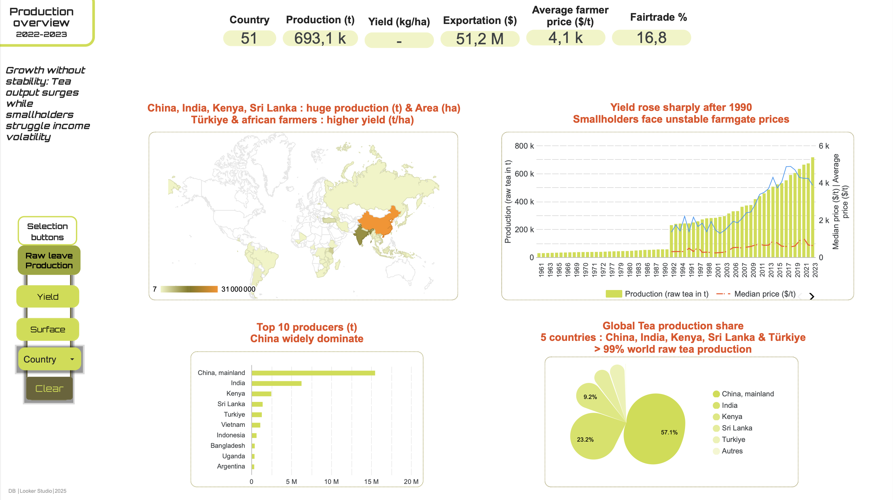
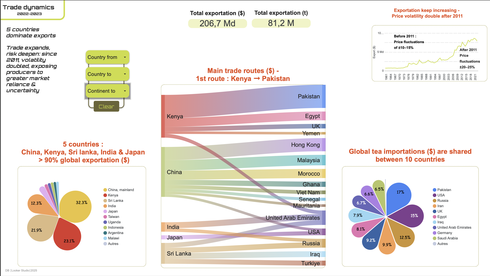
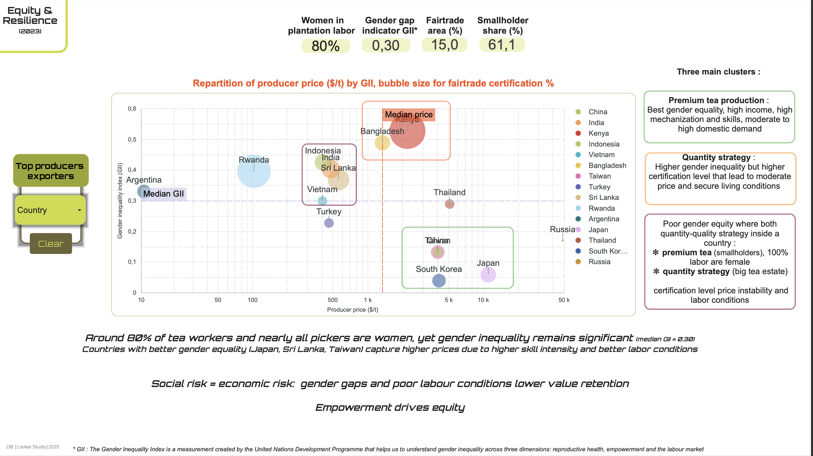
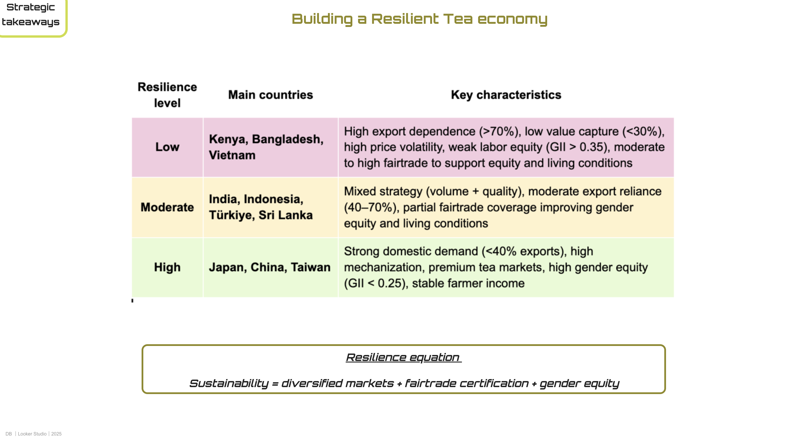
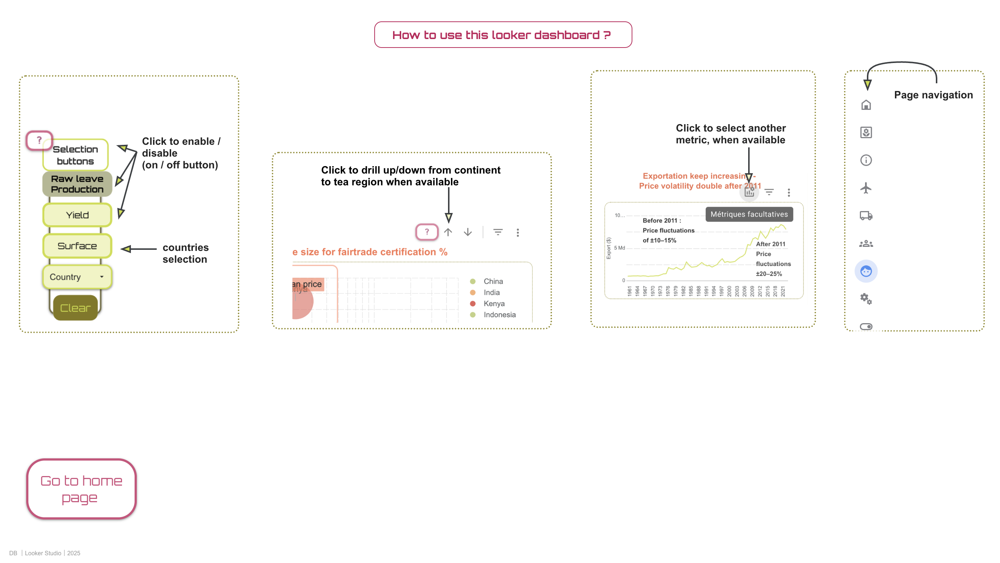

# 🌍 Global Tea Industry Dashboard (1961–2023) 🌱

**Data-driven analysis of how production growth, trade dynamics, and gender equity shape the resilience of the global tea economy.**

📊 **Tools:** Looker Studio · Python · Plotly  
📚 **Data Sources:** FAO, UNDP, Fairtrade, WFTO, Rainforest Alliance, Tea board of India, Sri Lanka, Kenya, Japan

---

## 🔎 Key Insights
- Tea production tripled since 1961, but income stability remains fragile.
- Export dependence (>70%) amplifies price volatility.
- Fairtrade certification and domestic markets cushion income shocks.
- Gender equity correlates with higher value capture and sustainability.

---

## Resilience Matrix (2023)

| **Resilience Level** | **Main Countries** | **Key Characteristics** |
|-----------------------|--------------------|--------------------------|
| 🟥 **Low** | Kenya, Bangladesh, Vietnam | High export reliance (>70%), low value capture (<30%), weak labor equity. |
| 🟨 **Moderate** | India, Indonesia, Türkiye, Sri Lanka | Mixed production strategy, moderate Fairtrade coverage, improving gender equity. |
| 🟩 **High** | Japan, China, Taiwan | Strong domestic demand, high mechanization, low GII, stable incomes. |

---

  
  
  
  
  
  
  

---

## 🌐 Interactive Dashboard
🔗 [Navigate and drill-down on Looker Studio]([https://lookerstudio.google.com/u/0/reporting/ec25178b-f374-412f-8016-e46661983be5/page/ia9WF](https://lookerstudio.google.com/reporting/ec25178b-f374-412f-8016-e46661983be5)

---

## 🧩 Author
**Dorothée Busier**  
Data Analyst· Agronomist · Sustainability & Trade Resilience  
📧 dorothee.busier@gmail.com | [LinkedIn](https://linkedin.com/in/dorothée-busier)
